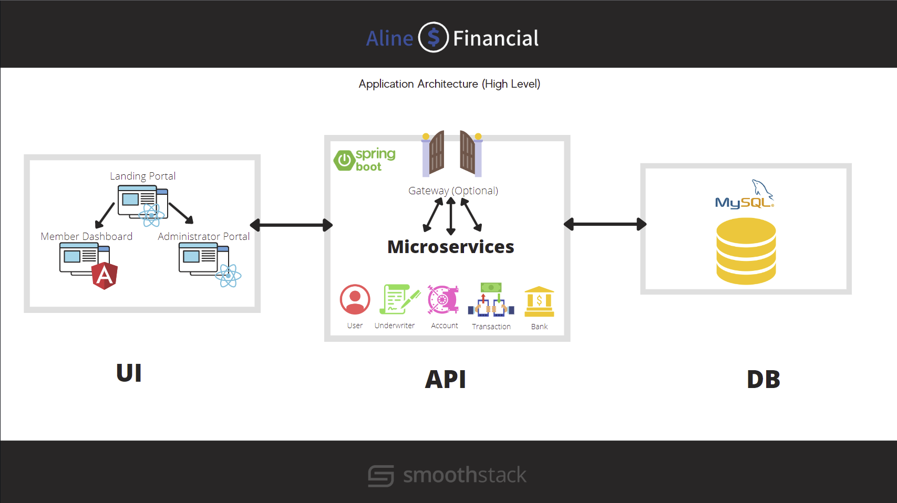

# Aline Data Generation

## Usage
This Python package are smoke tests that generate data to persist in a MySql database. Smoke tests verify that the most important functionality in our application is working. They are a cost-effective method for identifying and fixing defects in software.

The data generators leverage the Underwriter, User, and Bank microservice. It requires structuring in the config.py file (located in the program directory) where methods can be set to run or not run and method values are also set.

NOTE: The dockerfile is not optimized for containerization deployment. It was created to require a minimal repo folder sizes and should only be used for smoke tests.

## Installation

### Install Requirements:

1. [Docker Desktop](https://www.docker.com/products/docker-desktop/)
2. [VS Code](https://code.visualstudio.com)
3. [Docker extension](https://code.visualstudio.com/docs/containers/overview)
4. [Java SDK](https://www.oracle.com/java/technologies/javase/jdk11-archive-downloads.html)
5. [Apache Maven](https://maven.apache.org/install.html)

### Set up Docker Images for the Aline Financial application:

1. Clone the [Aline Devops](https://git1.smoothstack.com/cohorts/2022/organizations/cyber-cumulus/lynda-foster/aline-devops) repo. The underwriter and user microservice is slightly modified from the original repo to deactivate email verification.

3. Run microservices:

Right-click `docker-compose.yml` and select `Compose Up`

4. Create a python environment, activate environment, and install requirements. 

`pip intstall -r requirements.txt`

5. Set up testing scripts:

In the `progmainram` folder, modify `config.py` in your VS Code or other IDE to verify which methods and variables are required for this test. 

6. Run `main`:

`py main` or `python3 main`

## Support
lynda.foster@smoothstack.com 
[Cyber Cumulus Jira](https://cyber-cumulus-smoothstack.atlassian.net/jira/software/projects/CC/boards/1)

## Roadmap
- [x] Data Generation=
    - [x] Applicants
    - [x] Applications
    - [x] User Data Producer
    - [x] Banks and Branches - in progress

## Acknowledgements
Lead Developer:

[Lynda Foster](https://git1.smoothstack.com/lynda.foster)

With support from the Cyber Cumulus Team:

[Anthony Foster](https://git1.smoothstack.com/anthony.foster) 
[Nathan Galler](https://git1.smoothstack.com/nathan.galler) 
[Dennis Ghitas](https://git1.smoothstack.com/dennis.ghitas) 
[Sebastian Marzal](https://git1.smoothstack.com/sebastian.marzal)

## License
[MIT License](LICENSE.md)

## Project status
This portion of the project is completing development. 
